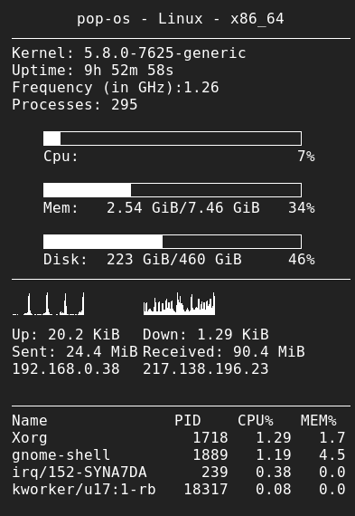

# Linux

Configuration for different linux tools.

## bashrc
Contains some shortcuts, aliases and useful command-line functions.  
Append the contents or any bits you want to `~/.bashrc`.  
Take it all with `cat .bashrc >> ~/.bashrc`

Aliases are under `.bash.d` so copy that too for aliases and other bash files in the future.

## conkyrc
My current conky config the way I like it (see screenshot below).  
No idea how the config works so let's hope I never have to change it!  
  
btw, that's not my public IP, I use Protonvpn :sunglasses:

## vim
actually use neovim now, so copy init.vim to `~/.config/nvim/init.vim`

## i3
Configuration for i3 window manager and i3 status bar.  
Will need to install a few dependencies:
* i3 related stuff: `i3 i3-lock i3status dmenu`
* program launcher, `i3-dmenu-desktop` or `rofi`
* terminal emulator, e.g. `gnome-terminal`
* browser, e.g. `firefox`
* file explorer, e.g. `nemo` or `ranger`
* screenshot software, e.g. `gnome-screenshot`
* `feh` for setting desktop wallpaper
* `imagemagick` for converting image for lockscreen image
* `nm-applet` if you use network manager for applet in the status bar
* `blueberry-tray` if you use bluetooth and want an applet in the status bar

Note, there are some other keybindings setup for spotify and dropbox, delete these if you don't install them.  

For i3 config: `cp config ~/.config/i3/config`  
For i3status config: `sudo cp i3status.conf /etc/i3status.conf`
